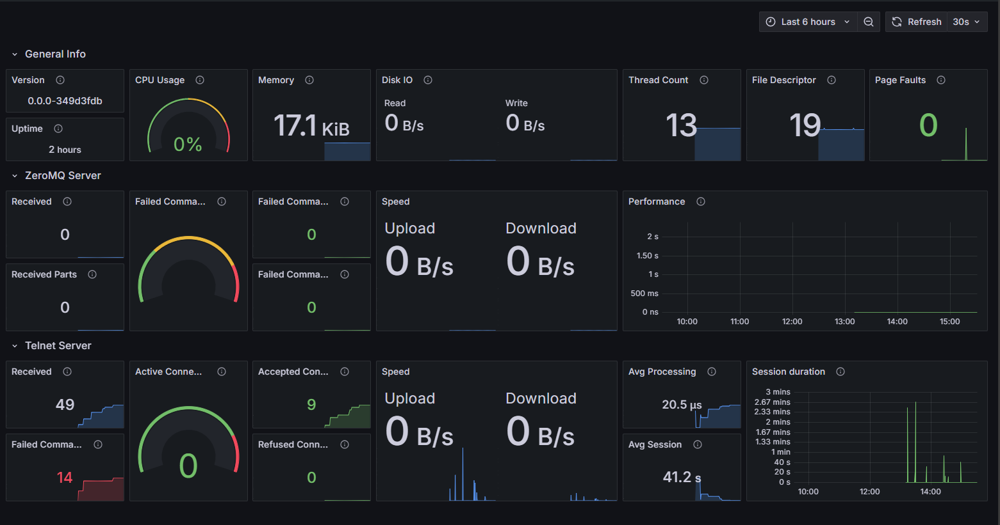

# Repo-Init

### ⚡ **Modern C++ Application Template with Enterprise-Grade Features** ⚡

  
  

  
  
  
  

---

## What is Repo-Init?

**Repo-Init** is a powerful, production-ready CMake template designed to kickstart your C++ applications with enterprise-grade features built-in. Say goodbye to boilerplate code and hello to modern, robust software development!

> 🔧 **Requires**: C++17 supported compiler

> 💡 **Perfect for**: Microservices, CLI tools, system applications, and performance-critical software

### **Key Features at a Glance**

<table align="center">
    <tr>
        <td align="center" width="33%">
            <h3>🛡️ <strong>Crash Protection</strong></h3>
            
Automatic minidump generation with <a
                    href="https://chromium.googlesource.com/crashpad/crashpad/"><strong>Crashpad</strong></a>

            
<em>Never lose critical debugging information</em>

        </td>
        <td align="center" width="33%">
            <h3>📊 <strong>Advanced Logging</strong></h3>
            
Multi-output logging with <strong>Spdlog</strong>

            
<em>File rotation • Syslog • Colorized console</em>

        </td>
        <td align="center" width="33%">
            <h3>🔗 <strong>Service Integration</strong></h3>
            
<a href="https://sentry.io/"><strong>Sentry</strong></a> • <a
                    href="https://grafana.com/oss/loki/"><strong>Grafana Loki</strong></a> • <a
                    href="https://prometheus.io/"><strong>Prometheus</strong></a>

            
<em>Real-time monitoring & alerting</em>

        </td>
    </tr>
    <tr>
        <td align="center">
            <h3>⚡ <strong>Performance Metrics</strong></h3>
            <ul>
                <li>Success/failure counters</li>
                <li>Min/max timing analysis</li>
                <li>Quantile-based bottleneck detection</li>
            </ul>
        </td>
        <td align="center">
            <h3>🌐 <strong>Network Ready</strong></h3>
            <ul>
                <li>Built-in Telnet server</li>
                <li><a href="https://zeromq.org/"><strong>ZeroMQ</strong></a> messaging</li>
                <li>HTTP connectivity</li>
            </ul>
        </td>
        <td align="center">
            <h3>🚀 <strong>Developer Experience</strong></h3>
            <ul>
                <li>One-command setup</li>
                <li>Comprehensive testing</li>
                <li>Auto-generated docs</li>
            </ul>
        </td>
    </tr>
</table>

---

> 💬 **Questions? Issues? Contributions?**
> Feel free to ask, use, and report any bugs you encounter! We ❤️ community feedback.

---

## Table of Contents

- [What is Repo-Init?](#-what-is-repo-init)
- [Table of Contents](#-table-of-contents)
- [CMake Modules](#-cmake-modules)
- [Utility Scripts](#-utility-scripts)
- [Dependencies](#-dependencies)
- [Testing Setup](#-testing-setup)
- [Build Targets](#-build-targets)
- [Grafana Integration](#-grafana-integration)

## CMake Modules

Our carefully crafted CMake modules provide powerful build automation:

| Module | 🎯 Purpose | ✨ Benefits |
|--------|------------|-------------|
| **CodeCoverage** | Detects and enables `gcovr` | 📊 Automatic test coverage reports |
| **CompilerSecurityOptions** | Enables/Disables secure compiler flags | 🛡️ Hardened binary security |
| **Doxy** | Finds Doxygen package and prepares docs | 📖 Auto-generated documentation |
| **GenerateSymbols** | Adds target for symbol file generation | 🔍 Enhanced debugging with minidumps |
| **GitVersion** | Gets SHA1 hash of current commit | 🏷️ Version tracking and build reproducibility |
| **GraphViz** | Finds GraphViz and dot executable | 🎨 Visual dependency graphs |

---

## Utility Scripts

> 💡 **Tip**: All scripts should be executed from the top-level directory

| Script | 🚀 Function | 📝 Description |
|--------|-------------|----------------|
| `firstName.sh` | **Name Changer** | Replaces placeholder names throughout the project |
| `dump_syms.py` | **Symbol Dumper** | Generates symbol files for crash analysis |

---

## Dependencies

### **Core Runtime Libraries**

<table>
    <tr>
        <td width="50%">
            <h4>🔥 <strong>Integrated Dependencies</strong></h4>
            
<em>Built and bundled automatically</em>

            <ul>
                <li>🔌 <a href="https://github.com/zeromq/cppzmq.git"><strong>CppZMQ</strong></a> - Modern C++ ZeroMQ
                    bindings</li>
                <li>💥 <a href="https://chromium.googlesource.com/crashpad/crashpad/"><strong>Crashpad</strong></a> -
                    Crash reporting system</li>
                <li>📅 <a href="https://github.com/HowardHinnant/date.git"><strong>Date</strong></a> - C++ date/time
                    library</li>
                <li>🌐 <a
                        href="https://github.com/j-ulrich/http-status-codes-cpp.git"><strong>Http-status-codes</strong></a>
                    - HTTP utilities</li>
                <li>📊 <a href="https://github.com/jupp0r/prometheus-cpp.git"><strong>Prometheus-cpp</strong></a> -
                    Metrics collection</li>
                <li>⚡ <a href="https://github.com/Tencent/rapidjson.git"><strong>RapidJSON</strong></a> - Ultra-fast
                    JSON parser</li>
                <li>🔐 <a href="https://github.com/getsentry/sentry-native.git"><strong>Sentry</strong></a> - Error
                    monitoring</li>
                <li>🖥️ <a href="https://github.com/lukemalcolm/TelnetServLib.git"><strong>TelnetServLib</strong></a> -
                    <em>Modified & embedded</em></li>
            </ul>
        </td>
        <td width="50%">
            <h4>🛠️ <strong>Development Dependencies</strong></h4>
            
<em>For building and testing only</em>

            <ul>
                <li>🔧 <a href="https://chromium.googlesource.com/breakpad/breakpad/"><strong>Breakpad</strong></a> -
                    Symbol dumping</li>
                <li>✅ <a href="https://github.com/google/googletest.git"><strong>GoogleTest</strong></a> - Unit testing
                    framework</li>
                <li>🔍 <a href="https://github.com/seladb/MemPlumber.git"><strong>MemPlumber</strong></a> - Memory leak
                    detection</li>
                <li>📦 <strong>ZLIB</strong> - Compression (required by Breakpad)</li>
            </ul>
            <h4>🌐 <strong>System Dependencies</strong></h4>
            
<em>Install via package manager (apt/dnf/brew)</em>

            <ul>
                <li>🌍 <a href="https://github.com/curl/curl"><strong>cURL</strong></a> - HTTP client library</li>
                <li>📝 <a href="https://github.com/gabime/spdlog.git"><strong>Spdlog</strong></a> - Fast logging library
                </li>
                <li>⚡ <a href="https://github.com/zeromq/libzmq.git"><strong>ZeroMQ</strong></a> - High-performance
                    messaging</li>
            </ul>
        </td>
    </tr>
</table>

> 📊 **Want to see the full picture?** Check out our complete [**dependency graph**](doc/dependency-tree.svg)!

---

## Testing Setup

### **Python Test Dependencies**

Our test suite requires some Python dependencies for comprehensive testing. Here's how to set them up:

<table>
    <tr>
        <td width="50%">
            <h4>🚀 <strong>Quick Setup</strong></h4>
            <pre><code class="bash">
    # Create virtual environment
    python3 -m venv .venv
     
    # Activate virtual environment
    source .venv/bin/activate  # Linux/macOS
    # OR
    .venv\Scripts\activate     # Windows
     
    # Install test dependencies
    pip install -r tests/data/requirements.txt</code></pre>
        </td>
        <td width="50%">
            <h4>📋 <strong>Required Dependencies</strong></h4>
            <ul>
                <li><strong>pyzmq</strong> - Python ZeroMQ bindings for testing messaging functionality</li>
            </ul>
            <h4>⚠️ <strong>Important Notes</strong></h4>
            <ul>
                <li>Virtual environment <strong>must be activated</strong> before running tests</li>
                <li>Dependencies are automatically detected by the test suite</li>
                <li>Deactivate with <code>deactivate</code> when done</li>
            </ul>
        </td>
    </tr>
</table>

---

## Build Targets

### **One Command, Multiple Possibilities**

| Target | 🚀 Command | 📋 Description |
|--------|------------|----------------|
| **all** | `cmake --build .` | Builds the complete project with all components |
| **coverage** | `cmake --build . --target coverage` | Generates comprehensive test coverage reports |
| **docs** | `cmake --build . --target docs` | Creates beautiful documentation with Doxygen |
| **dependency-graph** | `cmake --build . --target dependency-graph` | Visualizes project dependencies with GraphViz |
| **package** | `cmake --build . --target package` | Creates distribution packages (DEB/RPM + systemd service) |
| **test** | `ctest . --parallel` | Runs the complete test suite with GoogleTest |

> 💡 **Pro Tips**:
> - For packages, specify your preferred format with `-DCPACK_GENERATOR="DEB"` or `"RPM"`
> - Ensure Python virtual environment is activated before running tests!

---

### **Build Options**

**Customize your build with powerful CMake configuration options**

> 💡 **Important**: Re-run CMake configuration (`cmake -B build`) after changing any options

<table>
    <tr>
        <td width="60%">
            <h4>🧪 <strong>Testing & Quality Assurance</strong></h4>
            <table>
                <tr>
                    <th>Option</th>
                    <th>Description</th>
                    <th>Default</th>
                    <th>🎯 Use Case</th>
                </tr>
                <tr>
                    <td><code>XXX_BUILD_TESTS</code></td>
                    <td>🔧 Build all test suites</td>
                    <td><code>ON</code></td>
                    <td>Complete testing pipeline</td>
                </tr>
                <tr>
                    <td><code>XXX_BUILD_UNITTESTS</code></td>
                    <td>✅ Build unit tests only</td>
                    <td><code>ON</code></td>
                    <td>Fast development feedback</td>
                </tr>
                <tr>
                    <td><code>XXX_BUILD_FUZZTESTS</code></td>
                    <td>🎲 Build fuzz testing suite</td>
                    <td><code>OFF</code></td>
                    <td>Security & robustness testing</td>
                </tr>
                <tr>
                    <td><code>XXX_ENABLE_COVERAGE</code></td>
                    <td>📊 Generate test coverage reports</td>
                    <td><code>OFF</code></td>
                    <td>Code quality metrics</td>
                </tr>
                <tr>
                    <td><code>XXX_ENABLE_MEMLEAK_CHECK</code></td>
                    <td>🔍 Memory leak detection with MemPlumber</td>
                    <td><code>OFF</code></td>
                    <td>Debug memory issues</td>
                </tr>
            </table>
            <h4>🚀 <strong>Release & Distribution</strong></h4>
            <table>
                <tr>
                    <th>Option</th>
                    <th>Description</th>
                    <th>Default</th>
                    <th>🎯 Use Case</th>
                </tr>
                <tr>
                    <td><code>XXX_ENABLE_SYMBOL_GENERATION</code></td>
                    <td>🔧 Generate debug symbols for crash dumps</td>
                    <td><code>OFF</code></td>
                    <td>Production debugging</td>
                </tr>
                <tr>
                    <td><code>XXX_ENABLE_PACKAGING</code></td>
                    <td>📦 Enable DEB/RPM packaging with systemd</td>
                    <td><code>OFF</code></td>
                    <td>Distribution & deployment</td>
                </tr>
            </table>
        </td>
        <td width="40%">
            <h4>💡 <strong>Quick Examples</strong></h4>
            <pre><code class="bash"># Development build with all tests
cmake -B build -DXXX_BUILD_TESTS=ON \
                -DXXX_ENABLE_COVERAGE=ON
 
# Production build with packaging
cmake -B build -DXXX_BUILD_TESTS=OFF \
                -DXXX_ENABLE_PACKAGING=ON \
                -DXXX_ENABLE_SYMBOL_GENERATION=ON
 
# Security testing build
cmake -B build -DXXX_BUILD_FUZZTESTS=ON \
                -DXXX_ENABLE_MEMLEAK_CHECK=ON
 
# Minimal build (fastest)
cmake -B build -DXXX_BUILD_TESTS=OFF</code></pre>
            <h4>⚡ <strong>Pro Tips</strong></h4>
            <ul>
                <li>🏃 <strong>Fast Iteration</strong>: Disable tests for quick builds during development</li>
                <li>🔒 <strong>Security Focus</strong>: Enable fuzz tests and memory checks for critical code</li>
                <li>📈 <strong>CI/CD</strong>: Use coverage reports in your automated pipelines</li>
                <li>🚀 <strong>Production</strong>: Always enable symbol generation for crash analysis</li>
            </ul>
        </td>
    </tr>
</table>

## Grafana Integration

### **Real-Time Monitoring Made Beautiful**

Thanks to our integrated **Prometheus server**, monitoring your application has never been easier! Get instant insights into your application's performance, health, and behavior.

<table>
    <tr>
        <td width="50%">
            <h4>🚀 <strong>Quick Setup</strong></h4>
            <ol>
                <li><strong>Import Dashboard</strong>: Use our pre-built <a
                        href="scripts/GrafanaDashboard-1730032129887.json"><strong>Grafana template</strong></a></li>
                <li><strong>Connect Prometheus</strong>: Point to your app's metrics endpoint</li>
                <li><strong>Monitor</strong>: Watch real-time metrics flow in!</li>
            </ol>
            <h4>✨ <strong>What You Get</strong></h4>
            <ul>
                <li><strong>Performance Metrics</strong>: Response times, throughput, resource usage</li>
                <li><strong>Error Tracking</strong>: Real-time error rates and alerting</li>
                <li><strong>Resource Monitoring</strong>: CPU, memory, and system metrics</li>
                <li><strong>Custom Metrics</strong>: Track your application-specific KPIs</li>
            </ul>
        </td>
        <td width="50%">
            

                <h4>📸 <strong>Live Dashboard Preview</strong></h4>
                
                
<em>Beautiful, responsive, and information-rich monitoring</em>

            

        </td>
    </tr>
</table>

---

## 🤝 **Contributing & Support**

  <a href="https://github.com/egecetin/Repo-Init/issues">🐛 Report Issues</a> •
  <a href="https://github.com/egecetin/Repo-Init/discussions">💬 Discussions</a> •
  <a href="https://github.com/egecetin/Repo-Init/pulls">🔧 Pull Requests</a>

**Made with ❤️ for the C++ community**

*Star ⭐ this repo if you find it useful!*

---

